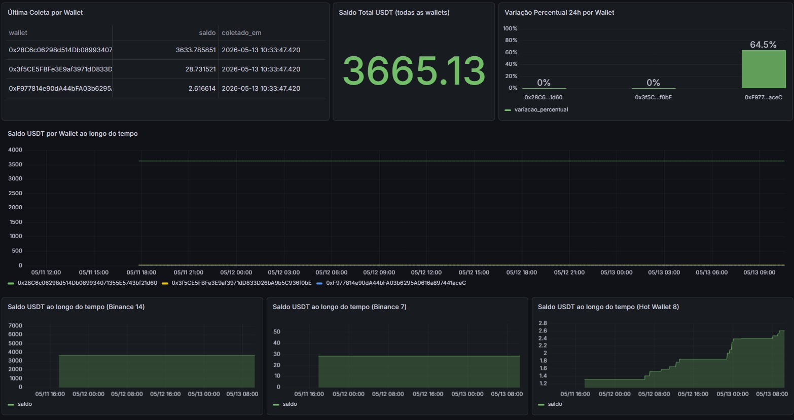
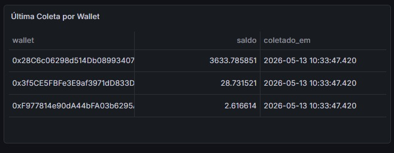
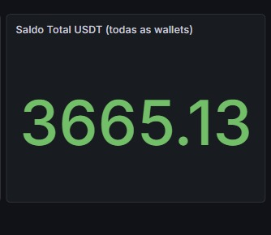
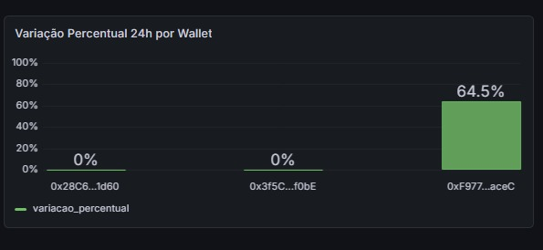
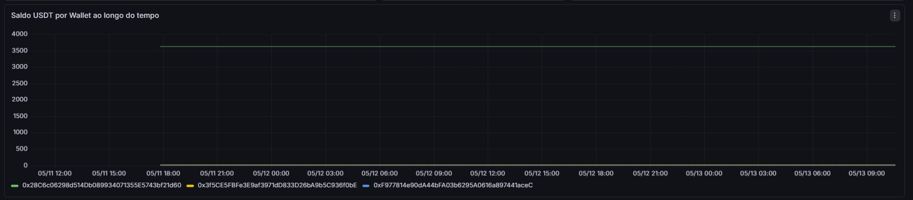
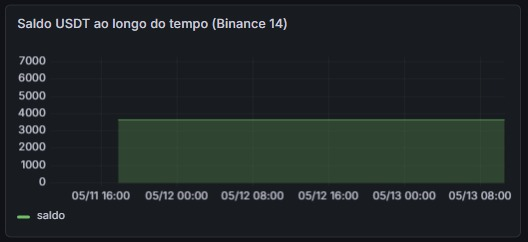
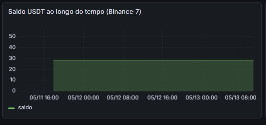
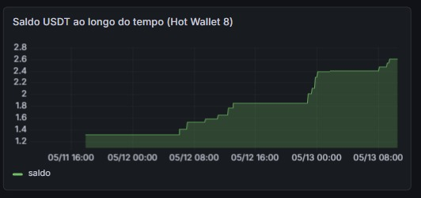
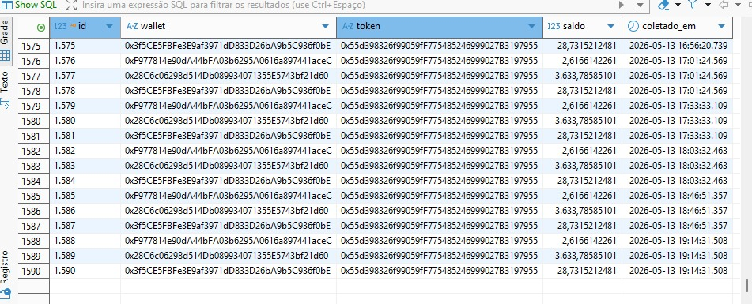

# Projeto 03 — Dashboard Grafana

Dashboard de monitoramento de wallets na Binance Smart Chain (BSC), lendo diretamente do banco PostgreSQL populado pelo Projeto 02. Com mais de 1.500 registros coletados automaticamente a cada 5 minutos durante 2 dias de monitoramento contínuo.

## Tecnologias

- Grafana (via Docker)
- PostgreSQL (via Docker)
- SQL puro (sem dashboard importado)

## Como rodar

```bash
# Subir o banco (se ainda não estiver rodando)
docker run --name postgres -e POSTGRES_USER=postgres -e POSTGRES_PASSWORD=postgres -e POSTGRES_DB=bsc_coletas -p 5432:5432 -d postgres

# Subir o Grafana
docker run -d -p 3000:3000 --name=grafana grafana/grafana

# Acessar
http://localhost:3000
```

Importar o dashboard salvo em `grafana/dashboard.json`.

---

## Dashboard completo

Visão geral com todos os painéis funcionando simultaneamente, mostrando dados reais coletados das wallets monitoradas ao longo do tempo.



---

## Painéis

### Última Coleta por Wallet

Tabela com o registro mais recente de cada wallet monitorada, mostrando o endereço, o saldo atual em USDT e o momento exato da última coleta.



---

### Saldo Total USDT (todas as wallets)

Painel Stat que soma o saldo mais recente de cada wallet e exibe o total consolidado em USDT. Atualiza automaticamente a cada nova coleta.



---

### Variação Percentual 24h por Wallet

Bar chart comparando a variação percentual de cada wallet nas últimas 24 horas. Calcula a diferença entre o saldo mais antigo e o mais recente do período.



---

### Saldo USDT por Wallet ao longo do tempo

Série temporal com uma linha por wallet, mostrando a evolução do saldo desde o início das coletas. A escala única evidencia a diferença de magnitude entre as wallets.



---

### Saldo ao longo do tempo — Binance 14

Série temporal individual da wallet Binance 14 (`0x28C6...`), com escala própria para melhor visualização. Mantém saldo estável em torno de 3.633 USDT.



---

### Saldo ao longo do tempo — Binance 7

Série temporal individual da wallet Binance 7 (`0x3f5C...`), com escala própria. Mantém saldo estável em torno de 28 USDT.



---

### Saldo ao longo do tempo — Hot Wallet 8

Série temporal individual da Hot Wallet 8 (`0xF977...`), com escala própria. É a wallet com maior variação percentual nas últimas 24h, saindo de 1.3 para 2.6 USDT aproximadamente.



---

## Dados coletados

Mais de 1.500 registros coletados automaticamente a cada 5 minutos durante 2 dias de monitoramento contínuo, armazenados no PostgreSQL com precisão de 18 casas decimais.



---
